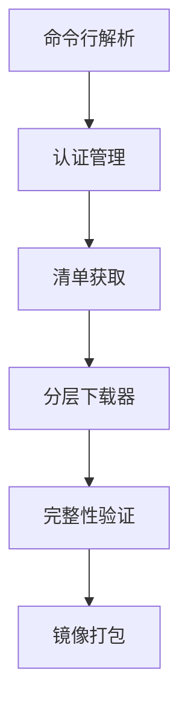

# Docker镜像下载工具（杜玛府版）

起源版：https://github.com/topcss/docker-pull-tar/releases/tag/v1.0.7

本来懒得搞，结果出现一点小问题，只好自己搞了。


### 🤖 Assistant

# Docker镜像下载工具 v16.0.0 使用说明书

## 目录
1. [产品概述](#1-产品概述)
2. [快速入门](#2-快速入门)
3. [详细使用指南](#3-详细使用指南)
4. [技术架构](#4-技术架构)
5. [故障排除](#5-故障排除)
6. [高级配置](#6-高级配置)
7. [附录](#7-附录)

---

## 1. 产品概述

### 1.1 功能特性
- 多架构镜像下载（支持amd64/arm等）
- 断点续传与自动重试机制
- 完整性校验（SHA256哈希验证）
- 两种打包格式支持：
  - 标准Docker格式
  - 群晖NAS专用格式
- 代理服务器支持
- 多线程下载控制

### 1.2 适用场景
- 离线环境部署Docker镜像
- 企业内网镜像仓库同步
- 容器镜像归档备份
- 跨架构镜像转换

### 1.3 系统要求
| 环境        | 要求                  |
|-----------|---------------------|
| 操作系统      | Windows/macOS/Linux |
| Python版本  | ≥3.8                |
| 内存        | ≥512MB              |
| 磁盘空间      | 镜像大小×2           |

---

## 2. 快速入门

### 2.1 基础使用（新手用户）
```bash
# 下载最新版Ubuntu镜像
python main.py ubuntu -o ./my_images

# 下载指定版本的Nginx镜像
python main.py nginx:1.21 -o ./web_server
```

下载完成后在`./my_images`目录中会生成：
- `[镜像名].tar`：打包好的镜像文件
- `docker_pull.log`：操作日志文件

### 2.2 常用参数速查
| 参数         | 说明                  | 示例                    |
|------------|---------------------|-----------------------|
| -a         | 指定CPU架构            | -a arm64             |
| -r         | 自定义镜像仓库地址         | -r my.registry.com   |
| --insecure | 跳过SSL证书验证         | --insecure           |
| -j         | 多线程下载数（提升速度）     | -j 3                 |

---

## 3. 详细使用指南

### 3.1 参数详解
```bash
python main.py [镜像名称] [选项]

必选参数：
  image              镜像名称格式：
                     [仓库/]镜像名[:标签]
                     示例：library/ubuntu:22.04

选项：
  -a ARCH, --arch ARCH
                    目标架构（默认：amd64）
                    ※ 支持：amd64, arm64, arm/v7等

  -r REGISTRY, --registry REGISTRY
                    镜像仓库地址（默认：registry-1.docker.io）

  -o OUTPUT, --output OUTPUT
                    输出目录（默认：./output）

  -j WORKERS, --workers WORKERS
                    并发下载线程数（默认：1）
                    ※ 建议值：2-5（根据网络带宽调整）

  -f FORMAT, --format FORMAT
                    打包格式选择：
                    docker - 标准Docker格式
                    synology - 群晖专用格式（默认）

  --insecure        禁用SSL证书验证（仅测试环境使用）
  --debug           启用调试日志模式
```

### 3.2 工作流程
1. **镜像解析**：解析输入镜像名称
2. **认证获取**：获取Docker Registry访问令牌
3. **清单下载**：获取镜像架构清单
4. **分层下载**：并行下载镜像层文件
5. **完整性校验**：逐层验证SHA256哈希
6. **镜像打包**：按指定格式生成最终镜像包

---

## 4. 技术架构

### 4.1 核心模块


### 4.2 关键技术点
- **自适应认证**：自动处理令牌过期和刷新
- **分块校验**：每512KB数据块实时校验
- **智能重试**：三级重试策略：
  1. 瞬时错误（HTTP 5xx）：指数退避重试
  2. 网络中断：断点续传
  3. 认证失效：令牌自动刷新

- **安全机制**：
  - 临时文件隔离存储
  - 下载失败自动清理残留
  - 内存安全的数据流处理

---

## 5. 故障排除

### 5.1 常见问题速查表
| 现象                          | 解决方案                     |
|-----------------------------|--------------------------|
| 下载速度慢                     | ① 使用`-j`增加线程数<br>② 检查网络代理设置 |
| 提示"SSL证书验证失败"            | 添加`--insecure`参数        |
| 报错"未找到架构"                | ① 确认镜像支持该架构<br>② 使用`-a`指定正确架构 |
| 文件校验失败                    | ① 重试下载<br>② 检查存储空间是否充足 |
| 提示"认证失败"                  | ① 检查镜像名称拼写<br>② 确认仓库访问权限 |

### 5.2 日志分析指南
日志文件位置：`[输出目录]/docker_pull.log`

关键日志标记：
- `[DEBUG]`：调试信息（需启用--debug参数）
- `[WARNING]`：非致命性警告
- `[ERROR]`：需要立即处理的错误

典型错误处理：
```log
ERROR 401 Unauthorized
→ 解决方案：检查镜像名称格式是否正确，确认是否有访问权限

ERROR 证书验证失败
→ 添加--insecure参数或配置SSL证书：
  export REQUESTS_CA_BUNDLE=/path/to/cert.pem

ERROR 磁盘空间不足
→ 清理存储空间或指定更大容量的输出目录
```

---

## 6. 高级配置

### 6.1 代理设置
```bash
# 临时设置代理
export HTTP_PROXY="http://proxy.example.com:8080"
export HTTPS_PROXY="http://proxy.example.com:8080"

# 使用代理下载
python main.py ubuntu --output ./proxy_download
```

### 6.2 自定义超时设置
通过修改源代码全局变量（需Python知识）：
```python
# 文件: main.py
CHUNK_SIZE = 1024 * 512    # 下载分块大小
MAX_RETRIES = 5            # 最大重试次数
RETRY_DELAY = 10           # 重试间隔（秒）
```

### 6.3 企业级部署建议
1. 镜像缓存服务器：配置本地Registry仓库
2. 安全加固：
   - 删除`--insecure`参数
   - 设置可信证书目录
3. 自动化集成：
   ```bash
   # 示例：Jenkins流水线集成
   python main.py ${IMAGE_NAME} \
     -a ${TARGET_ARCH} \
     -o ${WORKSPACE}/build \
     -f docker
   ```

---

## 7. 附录

### 7.1 版本更新记录
| 版本     | 更新内容                   |
|--------|------------------------|
| v16.0.0 | 初始发布版本                |

### 7.2 技术支持
联系开发者：杜玛  
邮箱：无  
问题反馈模板：
```
[操作系统版本]：
[Python版本]：
[复现步骤]：
[相关日志片段]：
[网络环境]：
```

### 7.3 法律声明
本工具遵循MIT开源协议，使用Docker API时请遵守Docker服务条款。

---

> **注意事项**：
> 1. 生产环境使用前请进行充分测试
> 2. 敏感镜像下载请遵守相关法律法规
> 3. 定期检查更新以获取安全补丁

[文档版本：2023-12-01]  [生成工具：docker_pull v16.0.0]
